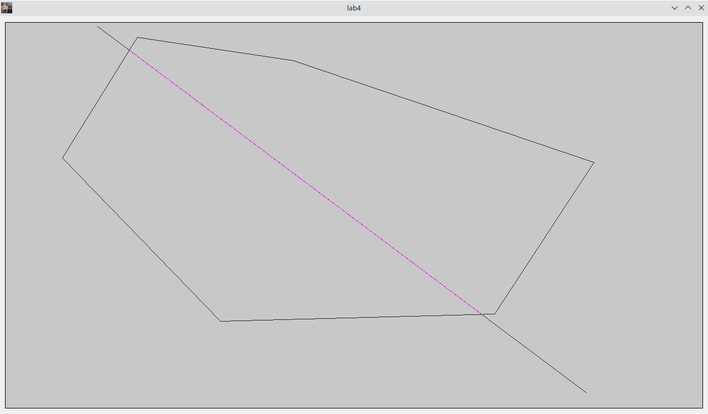

# etu2022_ComputerGraphic

# Компиляция

Используется `QT`:

- [Установка QT](https://github.com/The220th/SharedLib/blob/main/cpp/QT/INSTALL.md) <- тык

- В директории, где есть файл `что-то.pro` выполнить:

``` bash
> qmake

> make
```

# Использование

[В релизах](https://github.com/The220th/etu2022_ComputerGraphic/releases) можно скачать уже скомпилированные версии для Windows и для GNU/Linux: https://github.com/The220th/etu2022_ComputerGraphic/releases

Отдельное внимание обратить на запуск `lab1`, `lab3` и `lab3ez`.

В каждой работе в папке `imgsrc` есть файлы `calculating*.png`, в которых кратко объясняется теоритический базис. 

Во всех лабораторных работах: 1, 2, 3, 3ez, 4, 5, 5mod, 6, 6mod - для рисования используется **только** функция [`void QPainter::drawPoint(int x, int y)`](https://doc.qt.io/qt-5/qpainter.html#drawPoint-2).

## lab1

Сформировать отрезки, касательные к двум заданным окружностям с **внутренней** и **внешней** сторон, определив предварительно координаты точек касания. Необходимо предусмотреть возможность редактирования положения и параметры окружностей.


Для правильной работы, должен быть установлен `Python 3`. На `Linux` добиться того, чтобы `Python` запускался командой `python`, а не `python3`.

Также необходим пакет `scipy` для `Python 3`:

``` bash
> python -m pip install --upgrade pip

> pip3 install scipy
```

В `Windows` запускать, находясь в директории `./lab1`.

## lab2

Кривая Безье n-го порядка


``` bash
> ./lab2
```

## lab3

Поверхность Безье n-го порядка


``` bash
> ./lab3 [порядок]

# Например:
> ./lab3 3
```

### lab3ez

Билинейная поверхность


``` bash
> ./lab3ez p1_x p1_y p1_z p2_x p2_y p2_z p3_x p3_y p3_z p4_x p4_y p4_z

# Например:
> ./lab3ez 10 0 10 10 3 20 0 10 15 1 13 20
```

## lab4

Алгоритм Кируса-Бека с выпуклым окном.



``` bash
> ./lab4
```

## lab5

z-buffer


``` bash
> ./lab5
```

## lab5mod

z-buffer


``` bash
> ./lab5mod
```

Управление: стрелочки влево-вправо.

Файлы `calculating*.png` смотри в `lab5`.

## lab6

Тень


``` bash
> ./lab6
```

## lab6mod

Тень


``` bash
> ./lab6mod
```

Управление: стрелочки влево-вправо и AWSDXC (именно английская раскладка).

Файлы `calculating*.png` смотри в `lab6`.